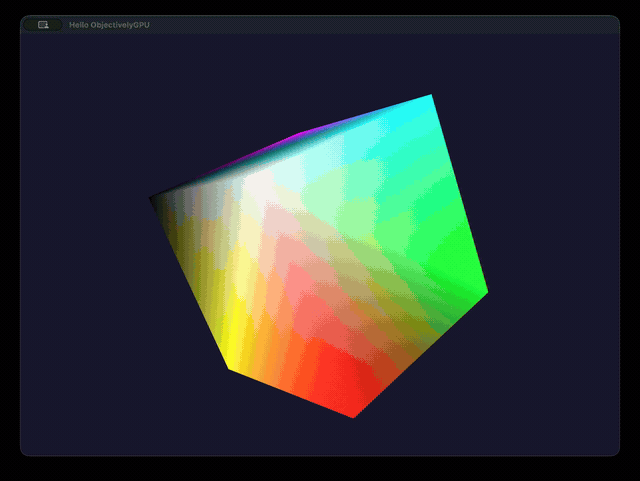
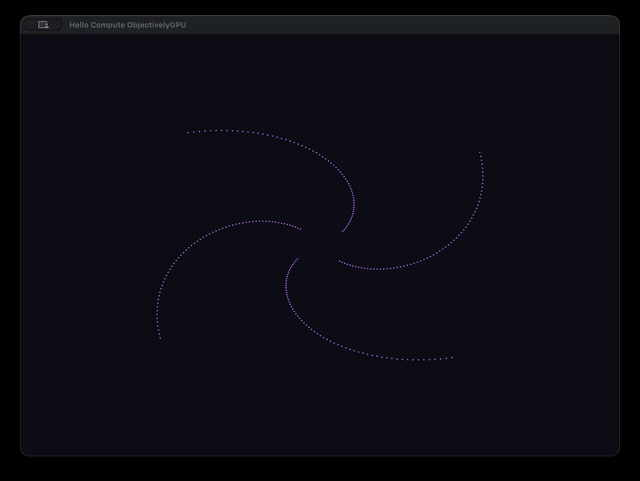

[](https://github.com/jdolan/ObjectivelyGPU/actions/workflows/build.yml)
[](https://opensource.org/licenses/Zlib)


# ObjectivelyGPU
Object oriented graphics framework for SDL3 and C.

Zlib [license](./COPYING).

## About
ObjectivelyGPU is a cross-platform, object oriented graphics framework for the C programming language.
Built on [Objectively](https://github.com/jdolan/Objectively) and [SDL3](https://libsdl.org)'s GPU API, it
provides a clean, idiomatic C API for modern GPU programming — targeting Metal, Vulkan, and Direct3D 12
through a single interface.

## Features
 * **macOS, iOS, Windows, Linux & Android** cross-platform support via SDL3 (Metal, Direct3D 12, Vulkan)
 * **RenderDevice** with a `beginFrame` / `endFrame` loop over the swapchain
 * **Resource objects**: Buffer, Texture, Sampler, Shader, GraphicsPipeline, ComputePipeline
 * **Typed passes**: RenderPass, ComputePass, CopyPass with command-lifecycle validation
 * **Framebuffer** with multiple render targets, depth, and MSAA with automatic resolve
 * **Shaders** authored in GLSL and loaded via the Objectively Resource system
 * **Mathlib**: vector, matrix, and quaternion math for 3D graphics

## API Documentation

Browse the [API Documentation](https://jdolan.github.io/ObjectivelyGPU/) to explore the library.

## Getting Started

### Dependencies

* [Objectively](https://github.com/jdolan/Objectively) >= 2.0.0
* [SDL3](https://github.com/libsdl-org/SDL) >= 3.2.0

### Building

```sh
autoreconf -i
./configure
make && sudo make install
```

## Shaders

ObjectivelyGPU uses a **GLSL → SPIR-V → MSL** pipeline for cross-platform shader support:

* **GLSL** (Vulkan 4.5) is the source language for all shaders
* **glslc** (from [shaderc](https://github.com/google/shaderc)) compiles GLSL to SPIR-V
* **shadercross** (from [SDL_shadercross](https://github.com/libsdl-org/SDL_shadercross)) converts SPIR-V to MSL, using SDL3-aware buffer assignments

Both the SPIR-V and MSL blobs are versioned in the repository, so normal builds never invoke these tools.
Run `make shaders` after editing a `.glsl` file to regenerate the blobs.

### Installing the tools

```sh
# glslc (part of shaderc)
brew install shaderc

# shadercross — build from source (SPIR-V → MSL path; no DXC needed)
git clone https://github.com/libsdl-org/SDL_shadercross
cd SDL_shadercross
git submodule update --init --recursive external/SPIRV-Cross external/SPIRV-Headers external/SPIRV-Tools
cmake -S . -B build \
  -DSDLSHADERCROSS_VENDORED=ON \
  -DSDLSHADERCROSS_SPIRVCROSS_SHARED=OFF \
  -DSDLSHADERCROSS_CLI=ON \
  -DSDLSHADERCROSS_INSTALL=ON \
  -DCMAKE_BUILD_TYPE=Release
cmake --build build -j$(nproc)
sudo cmake --install build
```

> **Note:** `SDLSHADERCROSS_DXC=ON` and the `DirectXShaderCompiler` submodule are **not** required.
> DXC is only needed for HLSL input. The SPIR-V → MSL path used here works without it.

### GLSL binding layout (SDL3 GPU descriptor set convention)

| Stage    | Set | Binding | Usage                          |
|----------|-----|---------|--------------------------------|
| Vertex   | 0   | 0+      | Vertex samplers / storage bufs |
| Vertex   | 1   | 0+      | Vertex uniform buffers         |
| Fragment | 2   | 0+      | Fragment samplers / storage    |
| Fragment | 3   | 0+      | Fragment uniform buffers       |
| Compute  | 1   | 0+      | Read-write storage buffers     |
| Compute  | 2   | 0+      | Compute uniform buffers        |

## Examples & projects using ObjectivelyGPU

1. [Hello](Examples/Hello.c) renders a spinning, multisampled 3D cube.
1. [HelloCompute](Examples/HelloCompute.c) animates particles with a compute shader and draws them as points.
1. [ObjectivelyMVC](https://github.com/jdolan/ObjectivelyMVC) is a framework for modern game interfaces built on SDL3, Objectively and ObjectivelyGPU.
1. [Quetoo](https://github.com/jdolan/quetoo) is a free first-person shooter that uses Objectively, ObjectivelyGPU and ObjectivelyMVC extensively.

<p align="center">
  
  
</p>
